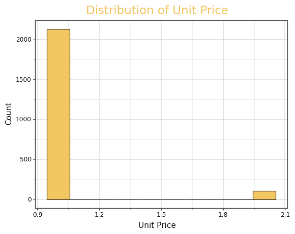
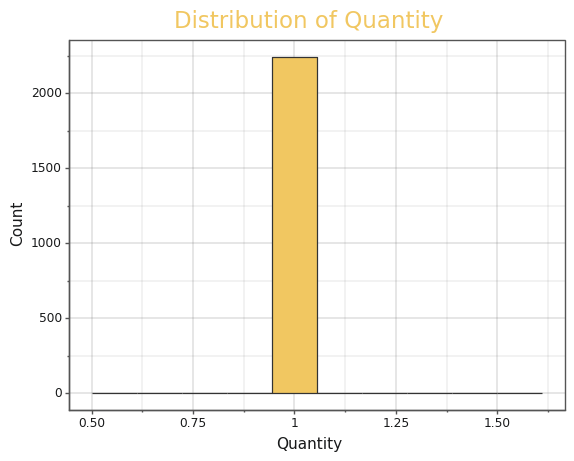
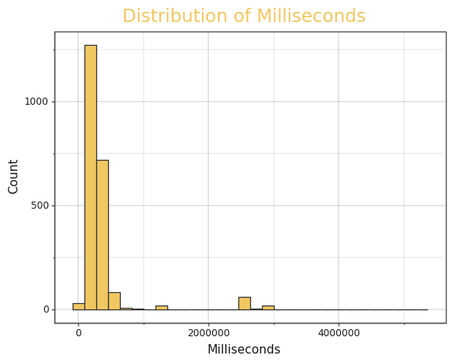
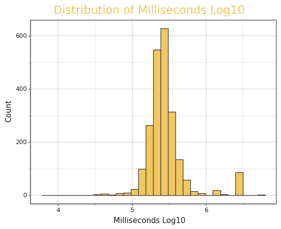
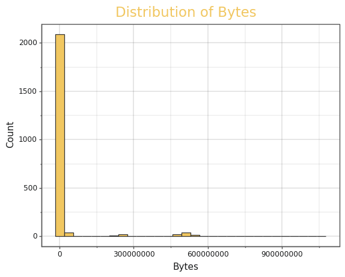
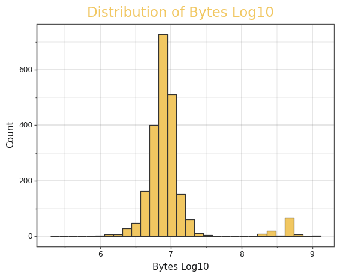
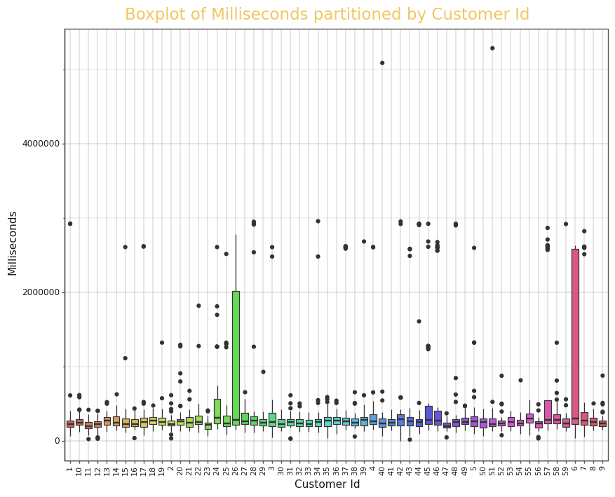
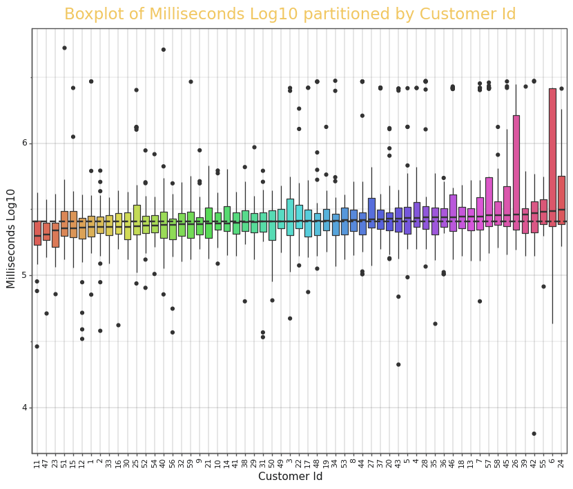

# Specialist Certificate in Data Analytics Essentials Assignment

## Chapter 3: Exploratory Data Analysis

## Imports


```python
%cd ..
```

    /home/michael/Documents/python_projects/UCDPA_Michael_Sandilands


```python
import pandas as pd
import numpy as np
from plotnine import (ggplot, aes, labs, 
                      geom_boxplot, theme, element_text,
                      geom_hline)
from plotnine.scales import scale_fill_discrete
from my_python_extensions.msand import theme_msand
from my_python_extensions.my_visualizations import plot_numeric_variable_distribution
```

## Import Data


```python
invoice_lines_df = pd.read_csv('./00_Data/invoice_lines.csv')
invoice_lines_df.head()
```


<div>
<style scoped>
    .dataframe tbody tr th:only-of-type {
        vertical-align: middle;
    }

    .dataframe tbody tr th {
        vertical-align: top;
    }

    .dataframe thead th {
        text-align: right;
    }
</style>
<table border="1" class="dataframe">
  <thead>
    <tr style="text-align: right;">
      <th></th>
      <th>InvoiceLineId</th>
      <th>InvoiceId</th>
      <th>CustomerId</th>
      <th>UnitPrice</th>
      <th>Quantity</th>
      <th>TrackName</th>
      <th>Composer</th>
      <th>Milliseconds</th>
      <th>Bytes</th>
      <th>GenreName</th>
      <th>AlbumTitle</th>
      <th>ArtistName</th>
    </tr>
  </thead>
  <tbody>
    <tr>
      <th>0</th>
      <td>1</td>
      <td>1</td>
      <td>2</td>
      <td>0.99</td>
      <td>1</td>
      <td>Balls to the Wall</td>
      <td>NaN</td>
      <td>342562</td>
      <td>5510424</td>
      <td>Rock</td>
      <td>Balls to the Wall</td>
      <td>Accept</td>
    </tr>
    <tr>
      <th>1</th>
      <td>2</td>
      <td>1</td>
      <td>2</td>
      <td>0.99</td>
      <td>1</td>
      <td>Restless and Wild</td>
      <td>F. Baltes, R.A. Smith-Diesel, S. Kaufman, U. D...</td>
      <td>252051</td>
      <td>4331779</td>
      <td>Rock</td>
      <td>Restless and Wild</td>
      <td>Accept</td>
    </tr>
    <tr>
      <th>2</th>
      <td>3</td>
      <td>2</td>
      <td>4</td>
      <td>0.99</td>
      <td>1</td>
      <td>Put The Finger On You</td>
      <td>Angus Young, Malcolm Young, Brian Johnson</td>
      <td>205662</td>
      <td>6713451</td>
      <td>Rock</td>
      <td>For Those About To Rock We Salute You</td>
      <td>AC/DC</td>
    </tr>
    <tr>
      <th>3</th>
      <td>4</td>
      <td>2</td>
      <td>4</td>
      <td>0.99</td>
      <td>1</td>
      <td>Inject The Venom</td>
      <td>Angus Young, Malcolm Young, Brian Johnson</td>
      <td>210834</td>
      <td>6852860</td>
      <td>Rock</td>
      <td>For Those About To Rock We Salute You</td>
      <td>AC/DC</td>
    </tr>
    <tr>
      <th>4</th>
      <td>5</td>
      <td>2</td>
      <td>4</td>
      <td>0.99</td>
      <td>1</td>
      <td>Evil Walks</td>
      <td>Angus Young, Malcolm Young, Brian Johnson</td>
      <td>263497</td>
      <td>8611245</td>
      <td>Rock</td>
      <td>For Those About To Rock We Salute You</td>
      <td>AC/DC</td>
    </tr>
  </tbody>
</table>
</div>


## Check for Duplicated Rows


```python
duplicates = invoice_lines_df.duplicated()
invoice_lines_df[duplicates]
```


<div>
<style scoped>
    .dataframe tbody tr th:only-of-type {
        vertical-align: middle;
    }

    .dataframe tbody tr th {
        vertical-align: top;
    }

    .dataframe thead th {
        text-align: right;
    }
</style>
<table border="1" class="dataframe">
  <thead>
    <tr style="text-align: right;">
      <th></th>
      <th>InvoiceLineId</th>
      <th>InvoiceId</th>
      <th>CustomerId</th>
      <th>UnitPrice</th>
      <th>Quantity</th>
      <th>TrackName</th>
      <th>Composer</th>
      <th>Milliseconds</th>
      <th>Bytes</th>
      <th>GenreName</th>
      <th>AlbumTitle</th>
      <th>ArtistName</th>
    </tr>
  </thead>
  <tbody>
  </tbody>
</table>
</div>


```python
print(sum(duplicates))
```

    0


There are no duplicated rows in our data frame.

## Inspect Data Types and Missing Values


```python
invoice_lines_df.info()
```

    <class 'pandas.core.frame.DataFrame'>
    RangeIndex: 2240 entries, 0 to 2239
    Data columns (total 12 columns):
     #   Column         Non-Null Count  Dtype  
    ---  ------         --------------  -----  
     0   InvoiceLineId  2240 non-null   int64  
     1   InvoiceId      2240 non-null   int64  
     2   CustomerId     2240 non-null   int64  
     3   UnitPrice      2240 non-null   float64
     4   Quantity       2240 non-null   int64  
     5   TrackName      2240 non-null   object 
     6   Composer       1644 non-null   object 
     7   Milliseconds   2240 non-null   int64  
     8   Bytes          2240 non-null   int64  
     9   GenreName      2240 non-null   object 
     10  AlbumTitle     2240 non-null   object 
     11  ArtistName     2240 non-null   object 
    dtypes: float64(1), int64(6), object(5)
    memory usage: 210.1+ KB


The columns all have the correct data type. Note the 'Id' columns are stored as "int64" although these columns have no numeric meaning, i.e. 'CustomerId' 1 is not greater than or less than 'CustomerId' 2.

The 'Composer' columns is the only column with missing values.


```python
print(invoice_lines_df['Composer'].isna().sum())
```

    596


There are 596 missing observations in the 'Composer' column.

Let's discover if 'Composer' will be a useful column before we dive deeper into the missing data exploration.

## How Many Customers Are There?


```python
invoice_lines_df['CustomerId'].unique().shape
```


    (59,)


There are 59 unique customers. This database only gives us a small cross-section of data. This analysis should be treated a prototype or a proof of concept for a much larger analysis.

## Summary Statistics and Distributions

### Numeric Columns


```python
invoice_lines_df[['UnitPrice', 'Quantity', 'Milliseconds', 'Bytes']].describe()
```


<div>
<style scoped>
    .dataframe tbody tr th:only-of-type {
        vertical-align: middle;
    }

    .dataframe tbody tr th {
        vertical-align: top;
    }

    .dataframe thead th {
        text-align: right;
    }
</style>
<table border="1" class="dataframe">
  <thead>
    <tr style="text-align: right;">
      <th></th>
      <th>UnitPrice</th>
      <th>Quantity</th>
      <th>Milliseconds</th>
      <th>Bytes</th>
    </tr>
  </thead>
  <tbody>
    <tr>
      <th>count</th>
      <td>2240.000000</td>
      <td>2240.0</td>
      <td>2.240000e+03</td>
      <td>2.240000e+03</td>
    </tr>
    <tr>
      <th>mean</th>
      <td>1.039554</td>
      <td>1.0</td>
      <td>3.754360e+05</td>
      <td>2.997591e+07</td>
    </tr>
    <tr>
      <th>std</th>
      <td>0.217069</td>
      <td>0.0</td>
      <td>5.072220e+05</td>
      <td>1.002514e+08</td>
    </tr>
    <tr>
      <th>min</th>
      <td>0.990000</td>
      <td>1.0</td>
      <td>6.373000e+03</td>
      <td>2.119970e+05</td>
    </tr>
    <tr>
      <th>25%</th>
      <td>0.990000</td>
      <td>1.0</td>
      <td>2.059815e+05</td>
      <td>6.332437e+06</td>
    </tr>
    <tr>
      <th>50%</th>
      <td>0.990000</td>
      <td>1.0</td>
      <td>2.564435e+05</td>
      <td>8.104544e+06</td>
    </tr>
    <tr>
      <th>75%</th>
      <td>0.990000</td>
      <td>1.0</td>
      <td>3.211360e+05</td>
      <td>1.020018e+07</td>
    </tr>
    <tr>
      <th>max</th>
      <td>1.990000</td>
      <td>1.0</td>
      <td>5.286953e+06</td>
      <td>1.059546e+09</td>
    </tr>
  </tbody>
</table>
</div>


#### Unit Price


```python
plot_numeric_variable_distribution(invoice_lines_df, 'UnitPrice', bins = 10, 
                                   fill = '#F1C761', colour = '#333333')
```


    

    


    <ggplot: (8749301219065)>


There is almost zero variance in the 'UnitPrice' column. This won't be a useful column for customer segmentation.

#### Quantity


```python
plot_numeric_variable_distribution(invoice_lines_df, 'Quantity', bins = 10, 
                                   fill = '#F1C761', colour = '#333333')
```


    

    


    <ggplot: (8749300629209)>


There is zero variance in quantity. This won't be a useful column for customer segmentation.

#### Milliseconds


```python
plot_numeric_variable_distribution(invoice_lines_df, 'Milliseconds', bins = 30, 
                                   fill = '#F1C761', colour = '#333333')
```


    

    


    <ggplot: (8749348680921)>


It's difficult to see the distribution because it's so skewed. Let's try again with the log10 of the distribution.


```python
plot_numeric_variable_distribution(invoice_lines_df, 'Milliseconds', log10 = True, bins = 30, 
                                   fill = '#F1C761', colour = '#333333')
```


    

    


    <ggplot: (8749301172797)>


This may be a useful column. It'll be interesting to see if the customers can be segmented by duration of the songs they've purchased.

#### Bytes


```python
plot_numeric_variable_distribution(invoice_lines_df, 'Bytes', bins = 30, 
                                   fill = '#F1C761', colour = '#333333')
```


    

    


    <ggplot: (8749300574117)>


Again the column is too skewed to see the distribution.


```python
plot_numeric_variable_distribution(invoice_lines_df, 'Bytes', log10 = True, bins = 30, 
                                   fill = '#F1C761', colour = '#333333')
```


    

    


    <ggplot: (8749300536433)>


Is this column redundant? It's easy to imagine that the duration of a track and it's size is highly correlated. Let's find out.


```python
np.corrcoef(invoice_lines_df['Milliseconds'], invoice_lines_df['Bytes'])
```


    array([[1.        , 0.96624438],
           [0.96624438, 1.        ]])


The correlation is very high, almost 1, meaning there's little point in using both these columns to segment customers as the information captured in one column is going to be approximately the same as the information captured in the other.

### Categorical Columns

The problem we face here is that there are so many unique categories across the categorical columns that there is no good way to visualize the distributions.

What I'm going to do instead is count the occurance of each unique observation for each column and use summary statistics about these counts to see if the column will be useful for customer segmentation.

#### Track Name


```python
invoice_lines_df.value_counts('TrackName').describe()
```


    count    1888.000000
    mean        1.186441
    std         0.440632
    min         1.000000
    25%         1.000000
    50%         1.000000
    75%         1.000000
    max         5.000000
    dtype: float64


In this cross-section of data there are 1888 unique tracks, the average count is very close to one. There's no use in trying mine customer segments with such disparate data. This won't be a useful column for customer segmentation.

#### Composer


```python
invoice_lines_df.value_counts('Composer').describe()
```


    count    572.000000
    mean       2.874126
    std        4.212178
    min        1.000000
    25%        1.000000
    50%        1.000000
    75%        3.000000
    max       58.000000
    dtype: float64


This column is a little better. There are 572 unique composers, the average count is around three but the median is still one. It will still be difficult to mine customer segments with such disparate data. This won't be a useful column for customer segmentation. There's no need to further explore this columns missing data.

#### Genre Name


```python
invoice_lines_df.value_counts('GenreName').describe()
```


    count     24.000000
    mean      93.333333
    std      184.958671
    min        6.000000
    25%       12.750000
    50%       24.000000
    75%       50.500000
    max      835.000000
    dtype: float64


There are 24 unique genres. The average count for each genre is 93 and the median is 24, there's one genre that shows up 835 times. This column may be very useful in customer segmentation.

#### Album Title


```python
invoice_lines_df.value_counts('AlbumTitle').describe()
```


    count    304.000000
    mean       7.368421
    std        4.728516
    min        1.000000
    25%        4.000000
    50%        7.000000
    75%       10.000000
    max       27.000000
    dtype: float64


There are 304 unique albums, with an average and median count of 7. Again the variance, while not as bad as the 'TrackName' and 'Composer' columns, will make it difficult to mine for customer trends.

#### Artist Name


```python
invoice_lines_df.value_counts('ArtistName').describe()
```


    count    165.000000
    mean      13.575758
    std       18.306387
    min        1.000000
    25%        4.000000
    50%        8.000000
    75%       17.000000
    max      140.000000
    dtype: float64


There are 135 unique artists, with an average count of 13 and a median of 8, there is one artist that shows up 140 times. This column may be useful for customer segmentation.

## Visualizing the Relationship Between Customer Id and Milliseconds


```python
ggplot(data=invoice_lines_df \
    .assign(CustomerId = lambda x: x['CustomerId'].astype(str))) + \
    geom_boxplot(aes(x = 'CustomerId', y = 'Milliseconds', fill = 'CustomerId')) + \
    scale_fill_discrete(guide = False) + \
    theme_msand() + \
    theme(axis_text_x=element_text(size=8, rotation=90),
          figure_size=(10, 8)) + \
    labs(
        title = 'Boxplot of Milliseconds partitioned by Customer Id',
        x = 'Customer Id'
    )
```


    

    


    <ggplot: (8749300395069)>


The skewed data makes the distributions harder to see. Transforming the 'Milliseconds' column using log10 and sorting the x-axis by the customer's median milliseconds will make the plot easier to read. I'll also add a reference line that represents the overall median to the plot. This will make it easier to see deviations from what would be a "normal" median duration.


```python
median_index = pd.concat(
    [invoice_lines_df[['CustomerId', 'Milliseconds']] \
        .groupby('CustomerId') \
        .transform(np.median) \
        .rename(columns = dict(Milliseconds = 'Median')),
    invoice_lines_df[['CustomerId', 'Milliseconds']]],
    axis=1
) \
    .sort_values('Median') \
    .CustomerId.unique().tolist()

# We need to convert the 'CustomerId' column to categorical and give our median_index as it's levels.
invoice_lines_df['CustomerId'] = pd.Categorical(invoice_lines_df['CustomerId'], categories=median_index)

# Transform the y-axis using log10 to more easily see trend
invoice_lines_df['MillisecondsLog10'] = np.log10(invoice_lines_df['Milliseconds'])

# Overall Median for our reference line
overall_median = np.median(invoice_lines_df['MillisecondsLog10'])

ggplot(data=invoice_lines_df) + \
    geom_boxplot(aes(x = 'CustomerId', y = 'MillisecondsLog10', fill = 'CustomerId')) + \
    geom_hline(aes(yintercept = overall_median), size = 1, color = '#333333', linetype = 'dashed') + \
    scale_fill_discrete(guide = False) + \
    theme_msand() + \
    theme(axis_text_x=element_text(size=8, rotation=90),
          figure_size=(10, 8)) + \
    labs(
        title = 'Boxplot of Milliseconds Log10 partitioned by Customer Id',
        x = 'Customer Id',
        y = 'Milliseconds Log10'
    )
```


    

    


    <ggplot: (8749299785105)>


There isn't a great deal of deviation from the baseline median. Clustering the customers according to their median duration may not reveal all that much. There is a great deal of outliers for each customer. Perhaps different quantiles will yield better clustering results?
