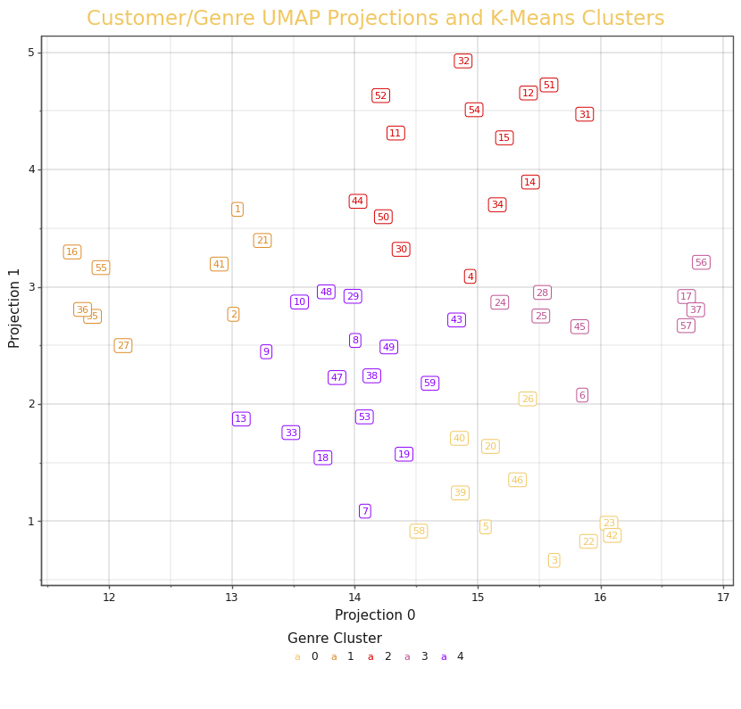
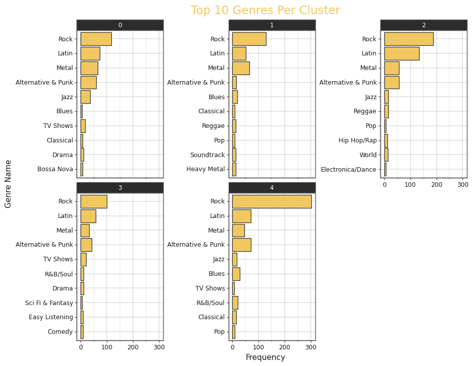
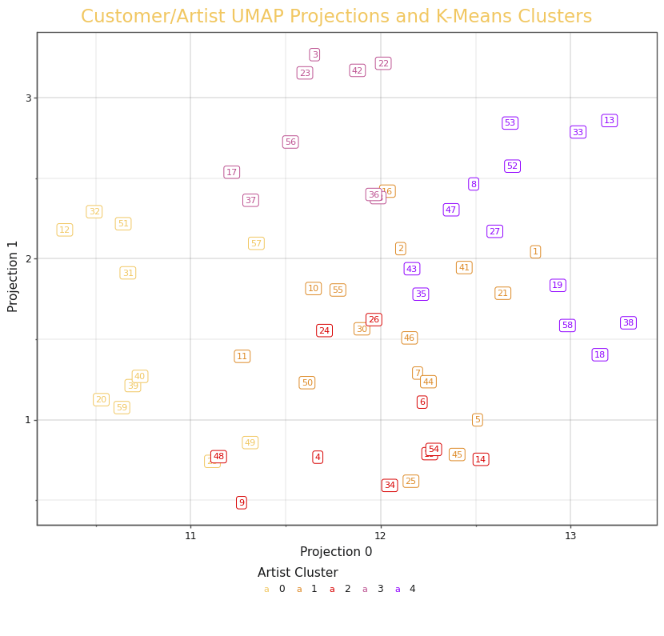
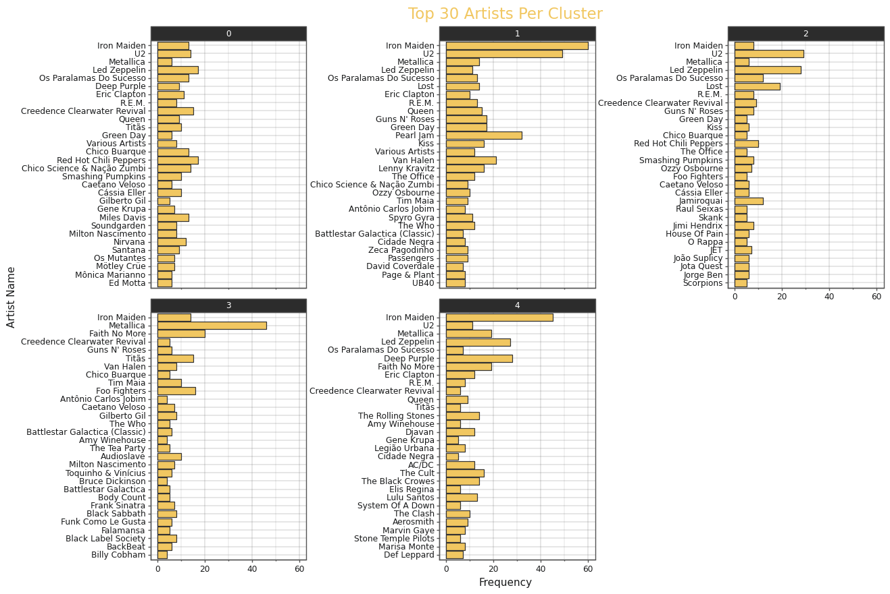
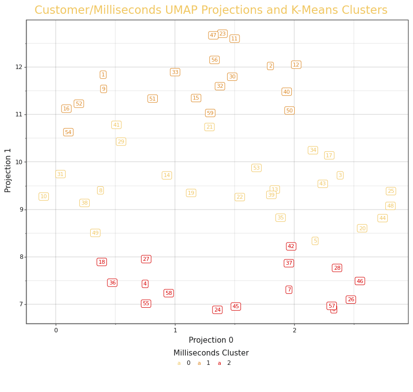
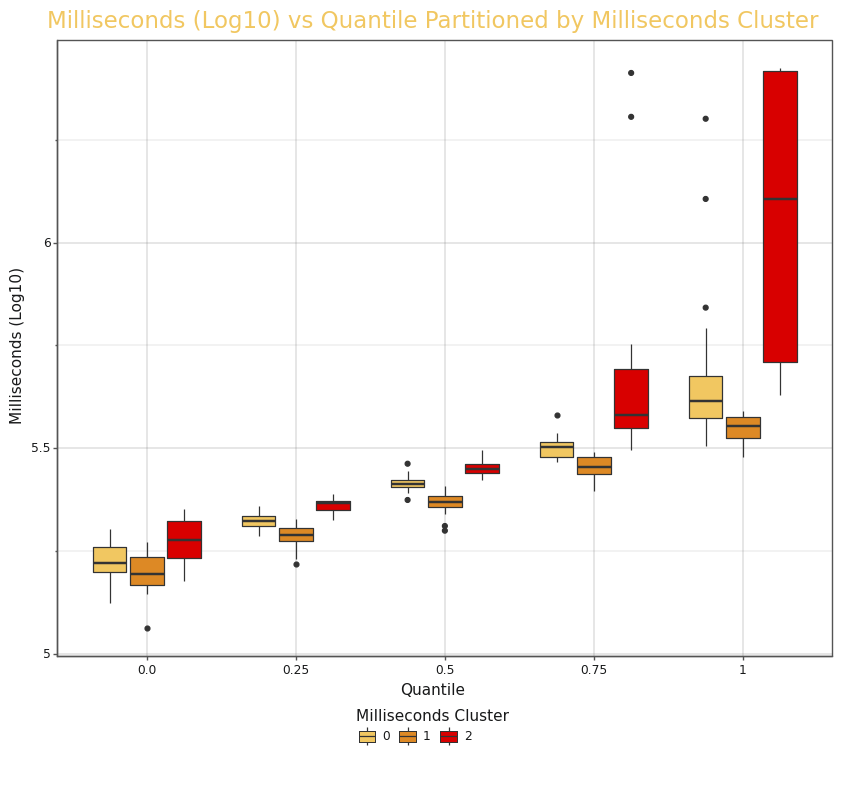

# Project Report

## Github URL

https://github.com/MichaelSandilands/UCDPA_Michael_Sandilands

## Abstract

**Which customers are similar?**

The aim of this project is to segment the customers in a database using features from the products they purchase. 

The project can be broken into five different parts:

### 1. Data Collection

A simple script to download the data from a github repository and store in locally. 

### 2. Data Merging

The data is stored in a relational database. There are eleven different tables in total and these have to be explored to uncover the columns that are pertinent to our business question and merged for analysis.

### 3. Exploratory Data Analysis

Now that we have the columns pertinent to the business question, we need to determine if they will be useful.

### 4. Data Preparation & Feature Engineering

Now we know what data will be useful it has to be prepared for the clustering. This involves:
- Placing the data in a customer/feature matrix. 
- Transform the data to approximate a normal distribution.
- Standardize the data so that large values don't dominate the analysis.
- Dimension reduction techniques. 

### 5. Clustering and Insights

The prepared data is then clustered using the K-Means algorithm. A range of clusters are fitted to each feature and inertia plots are used to find the optimal number of clusters. Insights are then drawn from these clusters.

## Introduction

I wanted a project that is a good approximation of an actual business workflow. For this I needed to find a relational database. The Chinook database fits the criteria for this assignment plus goals of mine beyond this coarse. 

I don't plan on stopping at clustering, I'm going to attempt to classify which customers are going to repurchase in the next 90 days. Not very well as there is such a small sample of data, which is why I stuck to clustering for this assignment. Such a small dataset would make it challenging to do things such as hyperparameter tuning as, with such a small sample, it is very unlikely to generalize well to never before seen data no matter what models or hyperparameters I use. 

But the goal is not to practice hyperparameter tuning or cross validation. The goal is to practice dashboard creation. I imagine a dashboard which displays insights into which customers are likely to repurchase in the next 90 days in conjunction with the clustering insights, will look very good on my github portfolio. 

I also utilized this project to enhance my visualization capabilities, creating my own personal theme for plotting.

## Dataset

The Chinook database is a fairly small cross-section of data, containing only 59 unique customers, but think of this as a sample to test a workflow that can be scaled to larger data in the future. The Chinook database includes tables for artists, albums, tracks, invoices, and customers.

A source for the data base can be found at [this github repository](https://github.com/lerocha/chinook-database). I'll be using the SQLite version of the database. 

## Implementation Process

### Data Collection

https://github.com/MichaelSandilands/UCDPA_Michael_Sandilands/tree/master/01_Data_Download

Steps:
- Retrieve the database using the `requests` module.
- Save the database locally.

### Data Merging

https://github.com/MichaelSandilands/UCDPA_Michael_Sandilands/tree/master/02_Data_Merging

Steps:
- Import data from database using the `sqlalchemy` module & a `dictionary`.
- Explore database tables using an `iterator`.
- `merge` the pertinent columns from these tables into a single `DataFrame`.
- Drop the unnecessary columns using `regex`. 
- Reorder columns using `list comprehension` and the unpacking `*` operator.
- Write merged `DataFrame` locally to `CSV`

### Exploratory Data Analysis

https://github.com/MichaelSandilands/UCDPA_Michael_Sandilands/tree/master/03_Exploratory_Data_Analysis

Steps: 
- Import data using `pd.read_csv()`.
- Check for `duplicated rows`.
- Inspect `data types` & `missing values`.
- Explore the numeric data using `summary statistics` and a created `function` to visualize `histograms`.
- Explore the categorical data using `summary statistics` on the `counts` for each column.
- Visualize the relationship between customer id and Milliseconds using `boxplots`.

### Data Preparation & Feature Engineering

https://github.com/MichaelSandilands/UCDPA_Michael_Sandilands/tree/master/04_Data_Preparation_and_Feature_Engineering

Steps:
- Import data using `pd.read_csv()`.
- Create a `function` to place the data in a customer/category frequency matrix. This function:
  - `Counts` each category.
  - `Pivots` these `counts` from a long format into a wide format.
  - Replaces `missing values` using the `fillna()` function.
- Process the `transformations` and `dimension reduction` on these customer/category frequency matrices to get them ready for clustering.
- Compute the `quantiles` for the numeric column and place these into a customer/quantile matrix.
- Process the `transformations` on the customer/quantile matrix to get it ready for clustering.
- Save the matrices to `CSV` files and save the processed matrices to `pickle` files.

### Clustering and Insights

https://github.com/MichaelSandilands/UCDPA_Michael_Sandilands/tree/master/05_Clustering_and_Insights

Steps:
- Import the `CSV` files and `pickle` files.
- `Fit` and visualize the optimal number of `K-Means clusters` using a created `function` which displays the `Inertia` vs `Number of Clusters`.
- `Fit` the optimal number of clusters to their respective data.
- `Visualize` the clusters using the `UMAP` projections.
- Use the `Clusters` to gain insights.
  - Visualize the top 10 Genres for each Genre cluster.
  - Use this plot to generate insights about what customers are similar in terms of Genre.
  - Explore why some Genres are ubiquitous across clusters using a created `function`, (this function can also be used to visualize the artist column).
  - Visualize the top 30 Artists for each Artist cluster.
  - Use this plot to generate insights about what customers are similar in terms of Artist.
  - Visualize boxplots of Milliseconds vs Quantile partitioned by Milliseconds cluster.
  - Use this plot to generate insights about Milliseconds clusters across quantiles.

## Results & Insights

I use UMAP Projections to generate insights for all the columns of interest. 

I use the top 10 Genres per Genre Cluster to generate insights which customers are similar in terms of Genre.

I use the top 30 Artists per Artist Cluster to generate insights which customers are similar in terms of Artist.

I use boxplots of Milliseconds vs Quantile partitioned by Milliseconds cluster to generate insights about the Milliseconds clusters across quantiles.

### Genre Name

#### Genre UMAP Projections

Besides showing us how the k-means algorithm segmented our data, this UMAP projection graph really lets us see which customers are most similar to each other. Take for example the 5 orange clusters on the left hand side of the plot, customer id 16, 55, 36, 35 and 27. These customers are well separated from any other points and are tightly clustered together. This suggests that these customers have very similar taste in genres.

#### Top 10 Genres Per Cluster

This plot shows the top 10 genres for each cluster. This plot will help us to know which genres to market to each customer. 

For example: 
- All Clusters like "Rock", "Latin", "Metal" and "Alternative & Punk". "Rock" is the most frequent in every cluster.
- Cluster 0: Likes "Rock" most of all, followed by "Latin", then "Metal" then "Alternative & Punk" then "Jazz".
- Cluster 1: Is the only cluster that breaks the top 4 trend of "Rock", "Latin", "Metal" and "Alternative & Punk", having a preference for "Blues" over "Alternative & Punk". "Metal" also out performs "Latin".
- Cluster 2: Has the highest frequency for the "Latin" genre out of all the customers. "Metal" and "Alternative & Puck" are neck and neck.
- Cluster 3: "Rock" performs the best followed by "Latin". "Alternative & Punk" outperforms "Metal". 
- Cluster 4: Has a very skewed distribution. Clearly having a preference for "Rock". "Alternative & Puck" is neck and neck with "Latin" and both outperform "Metal"

### Artist Name

#### Artist UMAP Projections

The UMAP projections and K-Means clusters for the artist name variable. Unfortunately we have some overlap between clusters. This is likely due to there being more dimensions than we are able to visualize.

#### Top 30 Artists Per Cluster

Here we have the top 30 Artists for each cluster. This plot will help us to know which Artists to market to each customer. 

For example: 
- Cluster 0 has no major stand out artists. Top Artists include: "Red Hot Chili Peppers", "Led Zeppelin", "Creedence Clearwater Revival", and "U2".
- Cluster 1 has some major stand out artists, "Iron Maiden", "U2" and "Pearl Jam" are clear favorites for this cluster.
- Cluster 2 has some mild stand out artists, "U2", "Led Zeppelin" and "Lost" are some favorites among this cluster.
- Cluster 3 has "Metallica" as it's stand out favorite. Other top artists include: "Faith No More", "Foo Fighters", "Titas" and "Iron Maiden".
- Cluster 4 has a major stand out favorite in "Iron Maiden". Other top artists include: "Deep Purple", "Led Zeppelin", "Faith No More" and "Metallica".

#### Milliseconds UMAP Projections

The UMAP projections and K-Means clusters for the Milliseconds variable. We can use this plot to see which customers are most similar to each other in terms of duration.

#### Milliseconds (Log10) vs Quantile Partitioned by Milliseconds Cluster

This plot shows how our Milliseconds features have been clustered. 

- Cluster 2 prefers longer duration of songs.
- Cluster 1 prefers shorter duration of songs.
- Cluster 0 rest in between cluster 1 & cluster 2.

# References

Chinook Database: https://github.com/lerocha/chinook-database
sqlalchemy: https://www.sqlalchemy.org
plotnine: https://plotnine.readthedocs.io/en/stable/
Clustering Concepts: https://developers.google.com/machine-learning/clustering
UMAP: https://umap-learn.readthedocs.io/en/latest/
